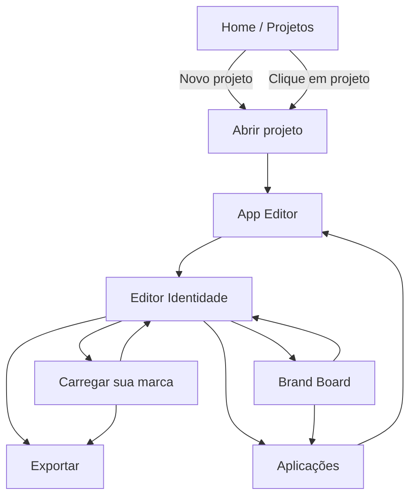

# Fluxo de navegação do GoBrand

Este documento mapeia o fluxo **real** de navegação do app com base em `index.html` e `script.js`.

## 1) Mapa de views principais

A função `nav(view)` controla as views visíveis e aceita estes estados:

- `home`
- `board`
- `apps`
- `editor`
- `brandImport`
- `export`
- `appEditor`

## 2) Fluxo macro (estado atual do produto)

## 3) Observações importantes de UX/navegação

- Ao abrir um projeto (`openProject`), o fluxo atual envia o usuário direto para **`appEditor`** (não para `editor`).
- A sidebar principal mostra `Projetos` sempre; a navegação contextual de projeto (`Editar`, `Brand Board`, `Aplicações`, `Exportar`) só aparece com projeto ativo.
- `brandImport` e `export` são áreas especializadas que dependem do projeto selecionado.

## 4) Entradas de navegação na interface

### Sidebar

- `Projetos` → `nav('home')`
- `Editar` → `nav('editor')`
- `Brand Board` → `nav('board')`
- `Aplicações` → `nav('apps')`
- `Exportar` → `nav('export')`

### Ações de cards e botões

- Card de projeto (home) → `openProject(id)`
- `Novo Projeto` → `createProject()` e depois `openProject(id)`
- Em `Brand Board`, botão “Nova Aplicação Rápida” → cria e pode abrir no editor de aplicação
- Em `Aplicações`, ação “Editar” → `openAppEditor(appId)`

## 5) Atalhos de teclado implementados (hoje)

- `Ctrl/Cmd + S`: salva projeto quando há projeto ativo.
- `Esc`: fecha menu contextual / fecha modal de cor.
- No `appEditor`: setas movem item selecionado (`Shift` acelera para passo 10).

## 6) Checklist rápido para evolução (Figma-like)

- [ ] Definir fluxo inicial de projeto: abrir em `editor` ou `appEditor` (hoje: `appEditor`).
- [ ] Unificar atalhos globais (ferramentas, zoom, pan, seleção) em um único módulo.
- [ ] Exibir diagrama de fluxo no próprio produto (ex.: ajuda/overview).
- [ ] Instrumentar analytics de navegação para medir gargalos entre `editor` ↔ `apps` ↔ `export`.

## 7) Sugestão de próximo passo prático

Se o objetivo é facilitar onboarding e reduzir confusão inicial, o ajuste de maior impacto é:

1. Abrir projeto em `editor` (identidade) por padrão.
2. Exibir CTA destacado para “Ir para Aplicações”.
3. Manter `appEditor` como etapa posterior de produção/exportação.
